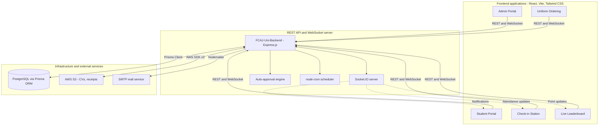

<div align="center">

# First Cloud AI Journey

### Hanoi

**FCAJ University Portal** — a unified platform for the FCAJ programme, covering student management, office desk booking, on-site check-in, recruitment, uniform distribution, and a real-time leaderboard.

[](https://awsfcaj.com)


</div>

---

## About

FCAJ University Portal digitises the day-to-day operations of the First Cloud AI Journey training programme. Five purpose-built frontend applications communicate with a single backend service that owns all business logic, persistence, and real-time coordination.

| Capability | Description |
| :--- | :--- |
| **Flexible desk booking** | Students reserve a seat by date, floor, and shift, subject to per-floor capacity limits. |
| **Rule-based auto-approval** | Administrators define rules that let the system approve or defer booking requests without manual intervention. |
| **Guard-operated attendance** | A lightweight station application lets building staff check students in and out by lookup or list import. |
| **Gamified participation** | Office attendance and speaking contributions accrue points that are pushed to a live leaderboard. |
| **Recruitment workflow** | HR publishes openings, students submit CVs, and reviewers assess applications online. |
| **Uniform logistics** | Students order uniforms, pay through a generated VietQR code, and upload the transfer receipt for reconciliation. |

---

## Architecture

The system follows a client-server model. Request and response traffic uses REST over HTTP; state changes that must reach connected clients immediately are broadcast over WebSocket (Socket.IO).



---

## Repositories

All source repositories are private. Each application is maintained as a Git submodule of the `FCAJ-Portal` orchestration repository.

| Repository | Responsibility | Stack |
| :--- | :--- | :--- |
| [`FCAJ-Portal`](https://github.com/FCAJ-Portal-HN/FCAJ-Portal) | Root monorepo: submodules, compose files, operational scripts | Shell, PowerShell, Docker |
| [`FCAJ-Uni-Backend`](https://github.com/FCAJ-Portal-HN/FCAJ-Uni-Backend) | REST API, WebSocket server, auto-approval, mail, object storage | Node.js, Express, Prisma, Socket.IO |
| [`FCAJ-Uni-Admin`](https://github.com/FCAJ-Portal-HN/FCAJ-Uni-Admin) | Operational console for administrators, HR, and reviewers | React, Vite, Recharts, FullCalendar |
| [`FCAJ-Uni-Client`](https://github.com/FCAJ-Portal-HN/FCAJ-Uni-Client) | Student portal: registration, booking, profile, CV management | React, Vite, i18n |
| [`FCAJ-Uni-Checkin`](https://github.com/FCAJ-Portal-HN/FCAJ-Uni-Checkin) | Check-in station for building staff | React, Vite |
| [`FCAJ-Uni-Leaderboard`](https://github.com/FCAJ-Portal-HN/FCAJ-Uni-Leaderboard) | Real-time participation leaderboard | React, Vite, Socket.IO |
| [`FCAJ-Uni-Uniform`](https://github.com/FCAJ-Portal-HN/FCAJ-Uni-Uniform) | Uniform ordering and VietQR payment reconciliation | React, Vite |
| [`FCAJ-Uni-Docs`](https://github.com/FCAJ-Portal-HN/FCAJ-Uni-Docs) | Product and operations documentation | HTML, Markdown |

---

## Getting Started

```bash
git clone --recurse-submodules https://github.com/FCAJ-Portal-HN/FCAJ-Portal.git
cd FCAJ-Portal
chmod +x run-projects.sh stop-projects.sh fcaj-dev-db.sh
docker compose -f docker-compose.dev-db.yml up -d
./run-projects.sh
```

The interactive launcher verifies database connectivity, installs missing dependencies, and starts the selected applications. Full instructions for environment variables, database initialisation, development ports, and production deployment are documented in the [`FCAJ-Portal`](https://github.com/FCAJ-Portal-HN/FCAJ-Portal) repository.

**Prerequisites:** Node.js 20 or newer, PostgreSQL 16 or newer, Docker, and Git 2.30 or newer with submodule support.

---

## Documentation

| Location | Contents |
| :--- | :--- |
| `docs/adr` | Architecture decision records and their rationale |
| `docs/wiki` | Operational runbooks and feature notes |
| [`FCAJ-Uni-Docs`](https://github.com/FCAJ-Portal-HN/FCAJ-Uni-Docs) | Product-level documentation |
| `fcaj-uni-s3/RULES.md` | Bucket layout and object naming conventions |

---

<div align="center">

Developed exclusively for **First Cloud AI Journey (FCAJ)**.
Copying, redistributing, or publishing the source code outside the organisation requires prior written approval from FCAJ management.

</div>
