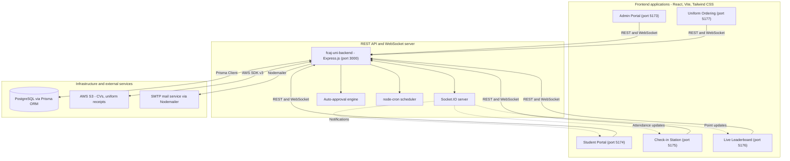

# First Cloud AI Journey (FCAJ) University Portal

A unified platform for the FCAJ programme covering student management, office desk booking, on-site check-in, recruitment, uniform distribution, and a real-time leaderboard.

---

## Table of Contents

- [Overview](#overview)
- [Architecture](#architecture)
- [Repository Layout](#repository-layout)
- [Applications](#applications)
  - [fcaj-uni-backend (REST API and WebSocket server)](#fcaj-uni-backend-rest-api-and-websocket-server)
  - [fcaj-uni-admin (Administration portal)](#fcaj-uni-admin-administration-portal)
  - [fcaj-uni-client (Student portal)](#fcaj-uni-client-student-portal)
  - [fcaj-uni-checkin (Check-in station)](#fcaj-uni-checkin-check-in-station)
  - [fcaj-uni-leaderboard (Live leaderboard)](#fcaj-uni-leaderboard-live-leaderboard)
  - [fcaj-uni-uniform (Uniform ordering)](#fcaj-uni-uniform-uniform-ordering)
- [Prerequisites](#prerequisites)
- [Running the Project](#running-the-project)
  - [Step 1. Clone the repository and its submodules](#step-1-clone-the-repository-and-its-submodules)
  - [Step 2. Configure environment variables](#step-2-configure-environment-variables)
  - [Step 3. Start PostgreSQL](#step-3-start-postgresql)
  - [Step 4. Initialise the database schema and seed data](#step-4-initialise-the-database-schema-and-seed-data)
  - [Step 5. Start the applications](#step-5-start-the-applications)
  - [Step 6. Stop the applications](#step-6-stop-the-applications)
  - [Local development ports](#local-development-ports)
- [Troubleshooting](#troubleshooting)
- [Production Deployment with Docker Compose](#production-deployment-with-docker-compose)
  - [Regional configurations (HCM and HN)](#regional-configurations-hcm-and-hn)
  - [Backend container start-up sequence](#backend-container-start-up-sequence)
  - [Published host ports](#published-host-ports)
  - [Building and pushing images](#building-and-pushing-images)
- [Security](#security)
- [Documentation](#documentation)
- [Licence and Ownership](#licence-and-ownership)

---

## Overview

FCAJ University Portal is a monorepo that digitises the day-to-day operations of the FCAJ training programme. Five purpose-built frontend applications communicate with a single backend service that owns all business logic, persistence, and real-time coordination.

Core capabilities:

- **Flexible desk booking.** Students reserve a seat by date, floor, and shift, subject to per-floor capacity limits.
- **Rule-based auto-approval.** Administrators define rules that let the system approve or reject booking requests without manual intervention.
- **Guard-operated attendance.** A lightweight station application lets building staff check students in and out by lookup or list import.
- **Gamified participation.** Office attendance and speaking contributions accrue points that are pushed to a live leaderboard.
- **Recruitment workflow.** HR publishes openings, students submit CVs, and reviewers assess applications online.
- **Uniform logistics.** Students order uniforms, pay through a generated VietQR code, and upload the transfer receipt for HR reconciliation.

---

## Architecture

The system follows a client-server model. Request and response traffic uses REST over HTTP; state changes that must reach connected clients immediately are broadcast over WebSocket (Socket.IO).



---

## Repository Layout

Each application lives in its own Git submodule; the root repository holds orchestration scripts, compose files, and documentation.

```
FCAJ-Portal/
├── fcaj-uni-backend/            API server: Node.js, Express, Prisma, Socket.IO
├── fcaj-uni-admin/              Frontend: administrators, HR, reviewers
├── fcaj-uni-client/             Frontend: students
├── fcaj-uni-checkin/            Frontend: check-in station for building staff
├── fcaj-uni-leaderboard/        Frontend: real-time leaderboard display
├── fcaj-uni-uniform/            Frontend: uniform ordering and reconciliation
├── fcaj-uni-s3/                 S3 bucket policies and storage conventions
├── FCAJ-Uni-Docs/               Product and operations documentation (submodule)
├── docs/                        Architecture decision records and wiki pages
├── School List/                 Reference data for the school import script
├── run-projects.sh              Interactive dev launcher for macOS and Linux
├── stop-projects.sh             Stops dev processes and frees ports (macOS, Linux)
├── fcaj-dev-db.sh               PostgreSQL detection, schema sync, seeding (macOS, Linux)
├── run-projects.ps1             Interactive dev launcher for Windows PowerShell
├── stop-projects.ps1            Stops dev processes and frees ports (Windows)
├── fcaj-dev-db.ps1              PostgreSQL detection, schema sync, seeding (Windows)
├── docker-compose.dev-db.yml    Local PostgreSQL 16 and pgAdmin for development
├── docker-compose-hcm.yml       Ho Chi Minh City stack, staging values
├── docker-compose-hcm.prod.yml  Ho Chi Minh City stack, production values
├── docker-compose-hn.yml        Hanoi stack, staging values
├── docker-compose-hn.prod.yml   Hanoi stack, production values
├── build-and-push.sh            Build and push images (Linux)
├── build-and-push-mac.sh        Build and push images (macOS, cross-builds to linux/amd64)
└── build-and-push.ps1           Build and push images (Windows)
```

---

## Applications

### fcaj-uni-backend (REST API and WebSocket server)

The single source of truth for business logic, authorisation, and real-time events.

- **Authentication.** JWT-based, with short-lived access tokens and database-backed refresh tokens. Separate secrets are used for access, refresh, password reset, and email verification tokens.
- **Auto-approval service.** Evaluates booking requests against shift configuration, per-floor capacity, accumulated points, and tag priority, then approves or defers them.
- **AWS S3 integration.** Stores uploaded artefacts: application CVs, assignment files, workshop evidence, and uniform payment receipts.
- **Notifications and email.** Socket.IO pushes in-app notifications on approval events. Nodemailer combined with `node-cron` sends attendance reminders, policy violation notices, and uniform order confirmations.
- **Persistence.** PostgreSQL 16 accessed through Prisma ORM, with a seed script and a set of one-off data scripts under `scripts/`.

### fcaj-uni-admin (Administration portal)

Operational console for super administrators, HR administrators, and academic reviewers.

- **Analytics dashboard.** Recent activity, attendance rates, and booking volume rendered with Recharts.
- **User administration.** Role assignment, account status control (active, suspended, banned), and cohort tagging. Bulk import from Excel and report export are supported.
- **Approval oversight.** Live view of auto-approval progress, a weekly schedule built on FullCalendar, and manual override where required.
- **Email composition and audit.** A TinyMCE editor for designing broadcast templates, plus a delivery log recording successes and failures.

### fcaj-uni-client (Student portal)

The primary student-facing application, designed for both desktop and mobile use.

- **Registration with email OTP verification.**
- **Desk booking.** Calendar-driven selection of date, floor, and shift with remaining-capacity indicators.
- **Profile and CV management.** Contact details, school, avatar with client-side cropping, and CV upload for partner company applications.
- **Workshop evidence and internship stamping.** Submission of participation proof and stamp requests with live status tracking.
- **Internationalisation.** Runtime switching between Vietnamese and English.

### fcaj-uni-checkin (Check-in station)

A deliberately minimal interface optimised for a shared desktop or tablet at the building reception.

- **Fast check-in and check-out.** Lookup by name, email, or student ID against approved bookings for the current day.
- **Luma schedule import.** Reads attendee exports (CSV or Excel) from Luma and maps them onto attendance records for special events.
- **State synchronisation.** Each check-in is broadcast over Socket.IO to the admin console and the student's own session.

### fcaj-uni-leaderboard (Live leaderboard)

A display application that reinforces participation in office and academic activities.

- **Recognition layout.** Top three students on a podium, followed by the ranked list.
- **Scoring model.** Two points per office visit recorded by building staff, five points per session delivered as a speaker.
- **Real-time updates.** Subscribes to the `leaderboard:update` channel and animates rank changes as the backend recalculates scores.

### fcaj-uni-uniform (Uniform ordering)

Uniform ordering with a receipt-based reconciliation workflow.

- **Three-step order flow.** Size selection, delivery details, payment.
- **VietQR payment.** Generates a dynamic QR code carrying the exact amount and transfer reference expected by Vietnamese banking apps.
- **Receipt upload.** Transfer screenshots are stored in AWS S3 for HR verification and order approval.

---

## Prerequisites

| Requirement | Version | Notes |
| :--- | :--- | :--- |
| Node.js | 20.x or newer | Verified on Node 26.x. Includes npm. |
| PostgreSQL | 16 or newer | Either a native install or the provided Docker container. |
| Docker Desktop or Docker Engine | Any current release | Required for `docker-compose.dev-db.yml` and all deployment flows. |
| Git | 2.30 or newer | Submodule support is required. |
| Shell | bash 3.2 or newer (macOS, Linux) / PowerShell 7 (Windows) | The launcher scripts are provided for both platforms. |

---

## Running the Project

The instructions below cover local development. Commands are given for macOS and Linux first, with the Windows equivalent alongside.

### Step 1. Clone the repository and its submodules

```bash
git clone --recurse-submodules https://github.com/FCAJ-Portal/FCAJ-Portal.git
cd FCAJ-Portal
```

If the repository was cloned without `--recurse-submodules`:

```bash
git submodule update --init --recursive
```

Make the shell scripts executable once:

```bash
chmod +x run-projects.sh stop-projects.sh fcaj-dev-db.sh
```

### Step 2. Configure environment variables

Copy the example file in each application that provides one and fill in the required values.

```bash
cp fcaj-uni-backend/.env.example fcaj-uni-backend/.env
```

The backend requires the following groups of variables:

| Group | Variables | Purpose |
| :--- | :--- | :--- |
| Database | `DATABASE_URL`, `DB_HOST`, `DB_PORT`, `DB_NAME`, `DB_USER`, `DB_PASSWORD` | Prisma connection string and its components. |
| Server | `PORT`, `WS_PORT`, `NODE_ENV`, `BACKEND_URL` | Listener configuration and the origin used in outgoing email links. |
| Frontend origins | `CLIENT_URL`, `ADMIN_URL`, `CHECKIN_URL`, `LEADERBOARD_URL`, `UNIFORM_URL` | CORS and Socket.IO allowlist. The five local Vite ports are always permitted, so these are only required outside local development. |
| Tokens | `JWT_SECRET`, `JWT_REFRESH_SECRET`, `JWT_RESET_PASSWORD_SECRET`, `JWT_VERIFY_EMAIL_SECRET` and the matching expiration settings | Independent signing keys per token purpose. |
| Mail | `SMTP_HOST`, `SMTP_PORT`, `SMTP_USER`, `SMTP_PASS`, `SMTP_DISPLAY_NAME` | Outbound email. |
| Storage | `AWS_REGION`, `AWS_ACCESS_KEY_ID`, `AWS_SECRET_ACCESS_KEY`, `S3_BUCKET_UNIFORM` | S3 uploads. |
| Web push | `VAPID_PUBLIC_KEY`, `VAPID_PRIVATE_KEY`, `VAPID_SUBJECT` | Browser push notifications. |
| Limits | `RATE_LIMIT_WINDOW_MS`, `RATE_LIMIT_MAX_REQUESTS`, `MAX_FILE_SIZE`, `SESSION_SECRET` | Request throttling and upload constraints. |

Each frontend reads the API origin from its own `.env` file. Point it at the backend, for example `http://localhost:3000`.

| Application | Variable | Additional variables |
| :--- | :--- | :--- |
| `fcaj-uni-admin` | `VITE_API_BASE_URL` | `VITE_TINYMCE_API_KEY` for the email template editor |
| `fcaj-uni-client` | `VITE_API_BASE_URL` | — |
| `fcaj-uni-checkin` | `VITE_API_URL` | — |
| `fcaj-uni-leaderboard` | `VITE_API_BASE_URL` | — |
| `fcaj-uni-uniform` | `VITE_API_BASE_URL` | `VITE_OFFICE_ADDRESS` shown on the order form |

Never commit a populated `.env`; the root `.gitignore` already excludes these files.

### Step 3. Start PostgreSQL

The repository ships a development database stack containing PostgreSQL 16 and pgAdmin.

```bash
docker compose -f docker-compose.dev-db.yml up -d
```

This publishes PostgreSQL on `localhost:5432` and pgAdmin on `http://localhost:5050`. The credentials are defined in `docker-compose.dev-db.yml` and must match `DATABASE_URL` in `fcaj-uni-backend/.env`.

If port 5432 is already taken by an unrelated PostgreSQL instance, either stop that instance or remap the FCAJ container to a free port and update `DATABASE_URL` accordingly. See [Troubleshooting](#troubleshooting).

A native PostgreSQL installation is equally supported; create a database matching `DB_NAME` and grant access to `DB_USER`.

### Step 4. Initialise the database schema and seed data

The launcher performs this automatically, but the steps can be run directly:

```bash
cd fcaj-uni-backend
npm install
npx prisma generate
npx prisma db push
npx prisma db seed
node scripts/importSchoolsVi.js
node scripts/seed-email-templates.js
node scripts/seed-booking-templates.js
node scripts/seed-announcement-templates.js
node scripts/createAdmin.js
cd ..
```

`prisma db push` is run without `--accept-data-loss`, so it applies additive changes and refuses any operation that would drop or truncate existing data.

On an already-initialised database only `npx prisma db push` is needed to pick up schema changes.

### Step 5. Start the applications

**macOS and Linux**

```bash
./run-projects.sh
```

The launcher scans the development ports, prints their current state, and lets you toggle applications by number. Press `R` to start the selected set, `A` to select all, `N` to clear the selection, and `Q` to exit.

Non-interactive usage:

```bash
./run-projects.sh 1 2 3      # start backend, admin portal, student portal
./run-projects.sh all        # start every application
./run-projects.sh --help     # list the application numbers
```

Behaviour of the launcher:

- Ensures PostgreSQL is reachable before starting anything, and reports a clear error instead of seeding when authentication or connectivity fails.
- Offers to run `npm install` for any selected application whose `node_modules` directory is missing.
- Detects a process already holding a required port and offers to terminate it.
- Starts each application detached, writes output to `logs/<application>.log`, and records the process IDs in `.fcaj-pids.txt`.

Environment switches:

| Variable | Effect |
| :--- | :--- |
| `FCAJ_OPEN_TERMINAL=1` | On macOS, opens a dedicated Terminal window per application instead of running detached with log files. |
| `FCAJ_ASSUME_YES=1` | Answers every confirmation prompt with yes. Enabled by default in non-interactive mode. |

Follow a log stream with:

```bash
tail -f logs/fcaj-uni-admin.log
```

**Windows**

```powershell
.\run-projects.ps1
```

The PowerShell launcher provides the same menu and opens one PowerShell window per application.

**Starting a single application manually**

```bash
cd fcaj-uni-backend  && npm install && npm run start
cd fcaj-uni-admin    && npm install && npx vite --port 5173
```

### Step 6. Stop the applications

```bash
./stop-projects.sh        # macOS, Linux
```

```powershell
.\stop-projects.ps1       # Windows
```

Both scripts terminate the tracked process IDs together with their child processes, then sweep ports 3000 and 5173 through 5177 for any survivors. The PostgreSQL container is deliberately left running; stop it explicitly when required:

```bash
docker compose -f docker-compose.dev-db.yml stop
```

### Local development ports

| Application | Directory | Port | Command |
| :--- | :--- | :--- | :--- |
| Backend API and WebSocket | `fcaj-uni-backend` | 3000 | `npm run start` |
| Admin portal | `fcaj-uni-admin` | 5173 | `npx vite --port 5173` |
| Student portal | `fcaj-uni-client` | 5174 | `npx vite --port 5174` |
| Check-in station | `fcaj-uni-checkin` | 5175 | `npx vite --port 5175` |
| Live leaderboard | `fcaj-uni-leaderboard` | 5176 | `npx vite --port 5176` |
| Uniform ordering | `fcaj-uni-uniform` | 5177 | `npx vite --port 5177` |
| PostgreSQL (development) | `docker-compose.dev-db.yml` | 5432 | `docker compose -f docker-compose.dev-db.yml up -d` |
| pgAdmin (development) | `docker-compose.dev-db.yml` | 5050 | Started with the database stack |

---

## Troubleshooting

**Port 5432 is occupied by another PostgreSQL instance.** The launcher reports that the port is in use but that credentials are rejected. Identify the owner and choose one of the two resolutions:

```bash
docker ps --filter publish=5432
lsof -nP -iTCP:5432 -sTCP:LISTEN
```

Either free the port for the FCAJ container:

```bash
docker stop <conflicting-container>
docker compose -f docker-compose.dev-db.yml up -d
```

Or keep the existing instance and move the FCAJ database to another port by changing the published port in `docker-compose.dev-db.yml` to `5433:5432` and updating `DATABASE_URL` in `fcaj-uni-backend/.env` to use `localhost:5433`.

**`npm install` reports that install scripts were not run.** npm 11 blocks lifecycle scripts by default, which can leave native binaries such as `esbuild` uninstalled. Approve them explicitly:

```bash
npm approve-scripts esbuild
```

**Prisma Client is missing or out of date.** Regenerate it after any schema change:

```bash
cd fcaj-uni-backend && npx prisma generate
```

**A port stays occupied after the applications are stopped.** Run `./stop-projects.sh`, which sweeps every development port, or terminate the listener directly:

```bash
lsof -nP -tiTCP:5173 -sTCP:LISTEN | xargs kill -9
```

**A frontend cannot reach the API.** Confirm that `VITE_API_BASE_URL` (or `VITE_API_URL` for the check-in station) matches the backend origin. When serving a frontend from anything other than the local Vite ports, add its origin to the corresponding backend variable: `CLIENT_URL`, `ADMIN_URL`, `CHECKIN_URL`, `LEADERBOARD_URL`, or `UNIFORM_URL`. The effective allowlist is printed to the backend log at start-up.

---

## Production Deployment with Docker Compose

Every application ships a multi-stage Dockerfile. Frontends are compiled to static assets and served by nginx with gzip compression; the backend image excludes development dependencies.

### Regional configurations (HCM and HN)

Two independent regional stacks are provided so that each site runs its own database and services.

| File | Purpose |
| :--- | :--- |
| `docker-compose-hcm.yml` | Ho Chi Minh City stack with staging values. |
| `docker-compose-hcm.prod.yml` | Ho Chi Minh City stack with production values. |
| `docker-compose-hn.yml` | Hanoi stack with staging values. |
| `docker-compose-hn.prod.yml` | Hanoi stack with production values. |

```bash
docker compose -f docker-compose-hcm.yml up -d
docker compose -f docker-compose-hcm.prod.yml up -d
```

Host ports are parameterised, so they can be overridden through the environment without editing the compose files, for example `ADMIN_PORT=9092 docker compose -f docker-compose-hcm.prod.yml up -d`.

### Backend container start-up sequence

The backend service overrides its command with a start-up chain, so a freshly provisioned host converges on the same state as an existing one:

1. Poll `pg_isready` until the PostgreSQL service accepts connections.
2. Run `npx prisma migrate deploy`. If it fails, typically with P3005 against a pre-existing schema, fall back to `npx prisma db push --accept-data-loss`.
3. Run the Prisma seed script.
4. Seed email, booking, and announcement templates.
5. Create the default super administrator account from the configured credentials.
6. Start the server with `node src/index.js`.

Every seeding step is tolerant of failure and logged as skipped, so a restart never blocks on data that already exists. The container then reports health through the `/health` endpoint.

### Published host ports

Ho Chi Minh City stack:

| Container | Container port | Default host port | Public address |
| :--- | :--- | :--- | :--- |
| `fcaj-uni-postgres-hcm` | 5432 | 5433 | Internal to the Docker network |
| `fcaj-uni-backend-hcm` | 3000 | 3006 | `https://hcm-api.awsfcaj.com` |
| `fcaj-uni-client-hcm` | 80 | 8091 | `https://hcm-portal.awsfcaj.com` |
| `fcaj-uni-admin-hcm` | 80 | 8092 | `https://hcm-admin.awsfcaj.com` |
| `fcaj-uni-checkin-hcm` | 80 | 8093 | `https://hcm-checkin.awsfcaj.com` |
| `fcaj-uni-leaderboard-hcm` | 80 | 8094 | `https://hcm-leaderboard.awsfcaj.com` |
| `fcaj-uni-uniform-hcm` | 80 | 8095 | `https://hcm-uniform.awsfcaj.com` |

Hanoi stack:

| Container | Container port | Default host port |
| :--- | :--- | :--- |
| `fcaj-uni-postgres-hn` | 5432 | 5432 |
| `fcaj-uni-backend-hn` | 3000 | 3000 |
| `fcaj-uni-client-hn` | 80 | 8081 |
| `fcaj-uni-admin-hn` | 80 | 8082 |
| `fcaj-uni-checkin-hn` | 80 | 8083 |
| `fcaj-uni-leaderboard-hn` | 80 | 8084 |
| `fcaj-uni-uniform-hn` | 80 | 8085 |

### Building and pushing images

Images are published to the private registry `registry.awsfcaj.com`, tagged per region under `hcm/` and `hn/`.

```bash
./build-and-push.sh          # Linux
./build-and-push-mac.sh      # macOS, cross-builds for linux/amd64
```

```powershell
.\build-and-push.ps1         # Windows
```

Each script authenticates against the registry, builds the six service images, tags them for both regional namespaces, and pushes them.

Registry credentials are currently hard-coded in these scripts. They should be supplied through environment variables or a credential helper before the repository is shared more widely.

---

## Security

The backend applies the following controls. Items are listed as implemented in `fcaj-uni-backend/src`.

1. **Response headers.** Helmet is configured with a Content Security Policy to mitigate clickjacking and injected frame content.
2. **Origin allowlist.** CORS accepts only the origins listed in `CLIENT_URL`, `ADMIN_URL`, `CHECKIN_URL`, `LEADERBOARD_URL`, and `UNIFORM_URL`, plus the local Vite ports, and the same list gates the Socket.IO handshake. Credentialed requests are enabled, so the allowlist must stay exact.
3. **Input sanitisation.** A custom middleware normalises `req.body`, `req.query`, and `req.params`, neutralising characters that enable cross-site scripting.
4. **Session integrity.** Refresh tokens are rotated on use and persisted server-side, so a replayed or stolen token invalidates the affected token family.
5. **Credential protection.** Passwords are hashed with bcrypt, previous hashes are retained to block reuse, and repeated failed sign-in attempts trigger a temporary account lockout.
6. **Upload validation.** Dedicated middleware validates file type and size before an object reaches S3, bounded by `MAX_FILE_SIZE`.
7. **Request throttling.** Rate limiting is applied selectively at route level, for example on push notification resubscription. `RATE_LIMIT_WINDOW_MS` and `RATE_LIMIT_MAX_REQUESTS` are available for a global limiter, which is not yet wired up; extending coverage to the authentication routes is the recommended next step.
8. **Log hygiene.** Bearer tokens are redacted from access logs in production.

Outstanding items that should be addressed before the repository is shared beyond the core team: the production compose files carry fallback values for the JWT secrets, the database password, and AWS access keys, and the build scripts embed registry credentials. Move all of these into an untracked environment file or a secrets manager and rotate the exposed keys.

---

## Documentation

- `docs/adr` records architecture decisions and their rationale.
- `docs/wiki` holds operational runbooks and feature notes.
- `FCAJ-Uni-Docs` is a submodule containing product-level documentation.
- `fcaj-uni-s3/RULES.md` documents bucket layout and object naming conventions.

---

## Licence and Ownership

This system is developed exclusively for First Cloud AI Journey (FCAJ). Copying, redistributing, or publishing the source code outside the organisation requires prior written approval from FCAJ management.
